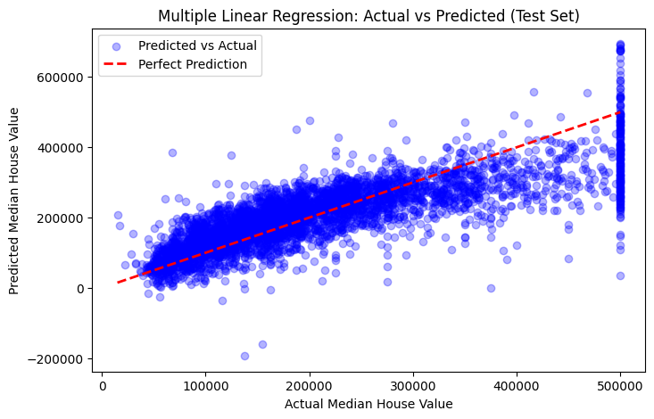
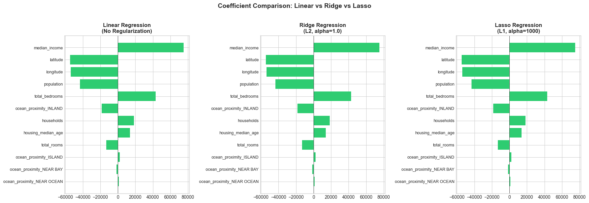
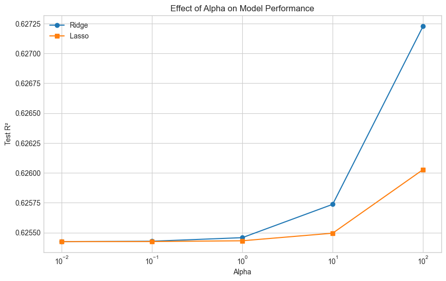

# 🏡 California Housing Price Prediction — Regression Analysis

Predicting median house values across California districts, comparing **Simple Linear**, **Multiple Linear**, **Ridge (L2)** and **Lasso (L1)** regression to study feature impact, regularization and overfitting.


## 📌 Overview

The dataset contains **20,640 California districts** from the 1990 census. It has 9 features: location (longitude, latitude), housing age, rooms, bedrooms, population, households, median income, and ocean proximity. The target is **`median_house_value`**, making this a supervised regression problem.

## 🔄 Workflow

| Step | Stage | Details |
|------|-------|---------|
| 1 | Data loading | 20,640 rows × 10 columns |
| 2 | Cleaning | 207 missing `total_bedrooms` values imputed with the median, which is robust to skew |
| 3 | EDA | Target distribution (right-skewed), correlation heatmap, income vs price analysis |
| 4 | Encoding | One-hot encoding of `ocean_proximity` |
| 5 | Split & scale | 80/20 train-test split; `StandardScaler` fit on the training set only |
| 6 | Modeling | Simple Linear → Multiple Linear → Ridge → Lasso |
| 7 | Tuning | Alpha sweep over [0.01 – 100] for Ridge and Lasso |
| 8 | Diagnostics | Train-test R² gap to check for overfitting; coefficient comparison across models |

## 📊 Results

| Model | Train R² | Test R² | Test RMSE ($) | Train–Test Gap |
|-------|----------|---------|---------------|----------------|
| Simple Linear (income only) | 0.477 | 0.459 | 84,209 | 0.018 |
| Multiple Linear | 0.650 | 0.625 | 70,061 | 0.025 |
| **Ridge (α = 100)** | 0.649 | **0.627** | **69,892** | 0.022 |
| Lasso (α = 100) | 0.650 | 0.626 | 70,004 | 0.024 |

**Takeaways**
- **Median income alone explains ~46% of price variation.** It is the single strongest predictor.
- Adding all features lifts test R² from **0.46 to 0.63** and cuts RMSE by about **$14K**.
- **Ridge performs best** on the test set, though the regularized models give only small gains. This suggests the linear model isn't overfitting; it is limited by linearity itself.
- All models show a **small train-test gap (< 0.03)**, so there is no significant overfitting.
- **Lasso kept every feature.** None were irrelevant enough to be zeroed out.

## 🔍 Feature Importance

The top drivers, by absolute standardized coefficient in multiple regression:

| Feature | Coefficient | Interpretation |
|---------|-------------|----------------|
| `median_income` | +75,168 | Higher-income districts have much pricier homes |
| `latitude` | −54,416 | Prices drop moving north |
| `longitude` | −53,827 | Prices drop moving inland (east) |
| `ocean_proximity_INLAND` | −18,506 | Inland homes cost less than coastal ones |

Location matters almost as much as income. Coastal Southern California commands a clear premium.

## 📈 Visualizations





## 🚀 Getting Started

```bash
git clone https://github.com/MMujtabaX/california-housing-price-regression.git
cd california-housing-price-regression
pip install -r requirements.txt
jupyter notebook regression.ipynb
```

## 📁 Project Structure

```
├── housing.csv          # Dataset
├── regression.ipynb     # Full analysis notebook
├── requirements.txt
└── README.md
```

## ⚠️ Limitations & Future Work

- **Price cap:** house values are capped at $500,001, which distorts predictions at the high end.
- **Linearity:** R² plateaus around 0.63. Tree-based models (Random Forest, XGBoost) would likely capture non-linear location effects much better.
- **Feature engineering:** ratios like rooms per household, bedrooms per room and population per household often improve this dataset significantly.
- **Log-transforming the skewed target** could stabilize the error.
- **Imputation** should move after the train-test split, inside a `Pipeline`, to fully prevent leakage.

## 📚 Dataset

California Housing dataset (1990 U.S. Census), popularized by *Hands-On Machine Learning* by Aurélien Géron.

## 👤 Author

**Muhammad Mujtaba Khan Suri** — CS @ UBIT, University of Karachi
[GitHub](https://github.com/MMujtabaX)
